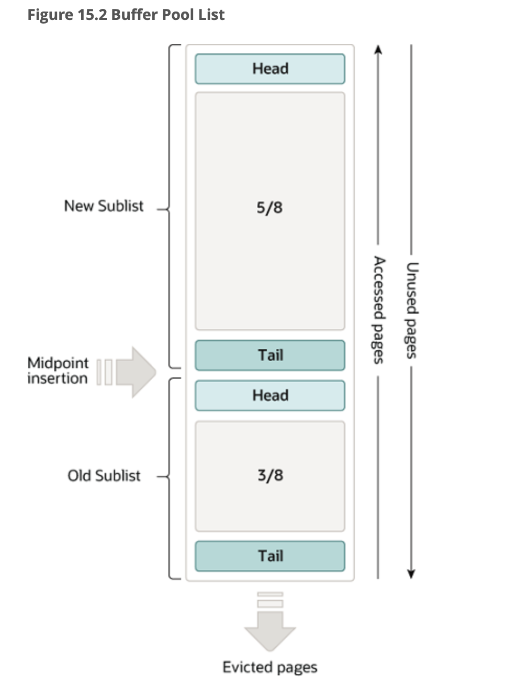

### 15.5.1 Buffer Pool

The buffer pool is an area in main memory where `InnoDB` caches table and index data as it is accessed. The buffer pool permits frequently used data to be accessed directly from memory, which speeds up processing. On dedicated servers, up to 80% of physical memory is often assigned to the buffer pool.

> 缓冲池是主内存中`InnoDB`缓存表和索引数据并能直接获取的一个区域。缓冲池允许直接从内存中访问经常使用的数据，从而加快处理速度。在专用服务器上，高达 80% 的物理内存通常分配给缓存池。

For efficiency of high-volume read operations, the buffer pool is divided into pages that can potentially hold multiple rows. For efficiency of cache management, the buffer pool is implemented as a linked list of pages; data that is rarely used is aged out of the cache using a variation of the least recently used (LRU) algorithm.

> 为了提高大容量读取操作的效率，缓冲池被划分为可能包含多行的页(page)，为提高缓存管理效率，缓冲池使用的页链表实现；使用LRU的变种算法，淘汰很少使用的数据。

Knowing how to take advantage of the buffer pool to keep frequently accessed data in memory is an important aspect of MySQL tuning.

>了解如何利用缓冲池将频繁访问的数据保存在内存中是 MySQL 调优的一个重要方面。

#### Buffer Pool LRU Algorithm

> 缓冲池LRU算法

The buffer pool is managed as a list using a variation of the LRU algorithm. When room is needed to add a new page to the buffer pool, the least recently used page is evicted and a new page is added to the middle of the list. This midpoint insertion strategy treats the list as two sublists:

> 使用 LRU 算法的变体把缓冲池当做列表进行管理。当需要向缓冲池添加新page时，最近最少使用的page将被逐出，并将新页面添加到列表的中间。中点插入策略将这个列表划分为两个子列表：

- At the head, a sublist of new (“young”) pages that were accessed recently

> 在头部，由经常被访问的new page组成

- At the tail, a sublist of old pages that were accessed less recently

> 在尾部，由最近最少被访问的old page组成



The algorithm keeps frequently used pages in the new sublist. The old sublist contains less frequently used pages; these pages are candidates for [eviction](https://dev.mysql.com/doc/refman/8.0/en/glossary.html#glos_eviction).

> 该算法将经常使用的页保留在新的子列表中。旧的子列表包含不常用的页，是要被淘汰的候选页。

By default, the algorithm operates as follows:

- 3/8 of the buffer pool is devoted to the old sublist.

> 缓冲池的 3/8 专用于旧子列表。

- The midpoint of the list is the boundary where the tail of the new sublist meets the head of the old sublist.

> 列表的中点是新子列表的尾部与旧子列表的头部相交的边界。

- When `InnoDB` reads a page into the buffer pool, it initially inserts it at the midpoint (the head of the old sublist). A page can be read because it is required for a user-initiated operation such as an SQL query, or as part of a [read-ahead](https://dev.mysql.com/doc/refman/8.0/en/glossary.html#glos_read_ahead) operation performed automatically by `InnoDB`.

>当 `InnoDB` 将一个page读入缓冲池时，它最初将其插入到中间点（旧子列表的头部）。page之所以能被读取，因为它是用户发起的操作所必需（例如 SQL 查询），或者作为 `read-ahead` 的一部分操作由 `InnoDB` 自动执行。

- Accessing a page in the old sublist makes it “young”, moving it to the head of the new sublist. If the page was read because it was required by a user-initiated operation, the first access occurs immediately and the page is made young. If the page was read due to a read-ahead operation, the first access does not occur immediately and might not occur at all before the page is evicted.

>访问旧子列表中的page使其“young”，会将其移动到新子列表的头部。如果页面是因为用户发起的操作而被读取的，则第一次访问会立即发生，并且page会变得年轻。如果由于预读操作而读取了page，则第一次访问不会立即发生，并且可能在page被淘汰之前都不会发生。

- As the database operates, pages in the buffer pool that are not accessed “age” by moving toward the tail of the list. Pages in both the new and old sublists age as other pages are made new. Pages in the old sublist also age as pages are inserted at the midpoint. Eventually, a page that remains unused reaches the tail of the old sublist and is evicted.

> 随着数据库的运行，缓冲池中未被访问的页面通过向列表尾部移动而“老化”。新旧子列表中的页面都会随着其他页面的更新而老化。旧子列表中的页面也会随着页面插入到中点而老化。最终，未使用的页面到达旧子列表的尾部并被淘汰。

By default, pages read by queries are immediately moved into the new sublist, meaning they stay in the buffer pool longer. A table scan, performed for a [**mysqldump**](https://dev.mysql.com/doc/refman/8.0/en/mysqldump.html) operation or a `SELECT` statement with no `WHERE` clause, for example, can bring a large amount of data into the buffer pool and evict an equivalent amount of older data, even if the new data is never used again. Similarly, pages that are loaded by the read-ahead background thread and accessed only once are moved to the head of the new list. These situations can push frequently used pages to the old sublist where they become subject to eviction. For information about optimizing this behavior, see [Section 15.8.3.3, “Making the Buffer Pool Scan Resistant”](https://dev.mysql.com/doc/refman/8.0/en/innodb-performance-midpoint_insertion.html), and [Section 15.8.3.4, “Configuring InnoDB Buffer Pool Prefetching (Read-Ahead)”](https://dev.mysql.com/doc/refman/8.0/en/innodb-performance-read_ahead.html).

>默认情况下，查询读取的页面会立即移动到新的子列表中，这意味着它们在缓冲池中的停留时间更长。表扫描，针对 [**mysqldump**](https://dev.mysql.com/doc/refman/8.0/en/mysqldump.html) 操作或没有 `WHERE` 子句的 `SELECT` 语句，可以将大量数据带入缓冲池并淘汰等量的旧数据，即使新数据不再使用。类似地，由预读后台线程加载并且仅访问一次的页面被移动到新列表的头部。这些情况会导致经常使用的页面被移动到旧的子列表中，在那里它们会被淘汰。有关优化此行为的信息请看15.8.3.3

`InnoDB` Standard Monitor output contains several fields in the `BUFFER POOL AND MEMORY` section regarding operation of the buffer pool LRU algorithm. For details, see [Monitoring the Buffer Pool Using the InnoDB Standard Monitor](https://dev.mysql.com/doc/refman/8.0/en/innodb-buffer-pool.html#innodb-buffer-pool-monitoring).

>`InnoDB` 的标准监视器输出，在 `BUFFER POOL AND MEMORY` 部分中包含有关缓冲池 LRU 算法操作的几个字段。

#### Buffer Pool Configuration

You can configure the various aspects of the buffer pool to improve performance.

>可以通过配置缓冲池的各种各样的参数以提高性能。

- Ideally, you set the size of the buffer pool to as large a value as practical, leaving enough memory for other processes on the server to run without excessive paging. The larger the buffer pool, the more `InnoDB` acts like an in-memory database, reading data from disk once and then accessing the data from memory during subsequent reads. See [Section 15.8.3.1, “Configuring InnoDB Buffer Pool Size”](https://dev.mysql.com/doc/refman/8.0/en/innodb-buffer-pool-resize.html).

> 理想情况下，将缓冲池的大小设置为尽可能大的值，从而为服务器上的其他进程留出足够的内存来运行而不会出现过多的分页（？）。缓冲池越大，“InnoDB”就越像内存数据库，从磁盘读取一次数据，然后在后续读取时从内存中访问数据。

- On 64-bit systems with sufficient memory, you can split the buffer pool into multiple parts to minimize contention for memory structures among concurrent operations. For details, see [Section 15.8.3.2, “Configuring Multiple Buffer Pool Instances”](https://dev.mysql.com/doc/refman/8.0/en/innodb-multiple-buffer-pools.html).

>在具有足够内存的 64 位系统上，可以将缓冲池拆分为多块，以最大程度地减少并发操作之间的内存结构争用.

- You can keep frequently accessed data in memory regardless of sudden spikes of activity from operations that would bring large amounts of infrequently accessed data into the buffer pool. For details, see [Section 15.8.3.3, “Making the Buffer Pool Scan Resistant”](https://dev.mysql.com/doc/refman/8.0/en/innodb-performance-midpoint_insertion.html).

> 可以将经常访问的数据保留在内存中，而不管突发的行为高峰将大量不经常访问的数据带入缓冲池。

- You can control how and when to perform read-ahead requests to prefetch pages into the buffer pool asynchronously in anticipation of impending need for them. For details, see [Section 15.8.3.4, “Configuring InnoDB Buffer Pool Prefetching (Read-Ahead)”](https://dev.mysql.com/doc/refman/8.0/en/innodb-performance-read_ahead.html).

> 可以控制执行预读请求的方式和时间，以异步方式将页面预取到缓冲池中，应对即将到来的需求

- You can control when background flushing occurs and whether or not the rate of flushing is dynamically adjusted based on workload. For details, see [Section 15.8.3.5, “Configuring Buffer Pool Flushing”](https://dev.mysql.com/doc/refman/8.0/en/innodb-buffer-pool-flushing.html).

> 可以控制何时发生后台刷新以及是否根据工作负载动态调整刷新速率

- You can configure how `InnoDB` preserves the current buffer pool state to avoid a lengthy warmup period after a server restart. For details, see [Section 15.8.3.6, “Saving and Restoring the Buffer Pool State”](https://dev.mysql.com/doc/refman/8.0/en/innodb-preload-buffer-pool.html).

> 可以配置 `InnoDB` 如何保留当前缓冲池状态以避免服务器重新启动后长时间的预热期


#### Monitoring the Buffer Pool Using the InnoDB Standard Monitor

> 使用 InnoDB 标准监视器监视缓冲池

`InnoDB` Standard Monitor output, which can be accessed using [`SHOW ENGINE INNODB STATUS`](https://dev.mysql.com/doc/refman/8.0/en/innodb-standard-monitor.html), provides metrics regarding operation of the buffer pool. Buffer pool metrics are located in the `BUFFER POOL AND MEMORY` section of `InnoDB` Standard Monitor output:

> `InnoDB` 标准监视器输出，可以使用 [`SHOW ENGINE INNODB STATUS`](https://dev.mysql.com/doc/refman/8.0/en/innodb-standard-monitor.html) 访问，提供关于缓冲池操作的指标。缓冲池指标位于“InnoDB”标准监视器输出的 `BUFFER POOL AND MEMORY`部分：

```sql
----------------------
BUFFER POOL AND MEMORY
----------------------
Total large memory allocated 2198863872
Dictionary memory allocated 776332
Buffer pool size   131072
Free buffers       124908
Database pages     5720
Old database pages 2071
Modified db pages  910
Pending reads 0
Pending writes: LRU 0, flush list 0, single page 0
Pages made young 4, not young 0
0.10 youngs/s, 0.00 non-youngs/s
Pages read 197, created 5523, written 5060
0.00 reads/s, 190.89 creates/s, 244.94 writes/s
Buffer pool hit rate 1000 / 1000, young-making rate 0 / 1000 not
0 / 1000
Pages read ahead 0.00/s, evicted without access 0.00/s, Random read
ahead 0.00/s
LRU len: 5720, unzip_LRU len: 0
I/O sum[0]:cur[0], unzip sum[0]:cur[0]
```

The following table describes buffer pool metrics reported by the `InnoDB` Standard Monitor.

Per second averages provided in `InnoDB` Standard Monitor output are based on the elapsed time since `InnoDB` Standard Monitor output was last printed.

>每秒刷新一次

**Table 15.2 InnoDB Buffer Pool Metrics**

| Name                         | Description                                                  |
| :--------------------------- | :----------------------------------------------------------- |
| Total memory allocated       | The total memory allocated for the buffer pool in bytes.<br />分配给缓冲池的总内存数（字节） |
| Dictionary memory allocated  | The total memory allocated for the `InnoDB` data dictionary in bytes.<br />分配给`InnoDB`数据字典的总内存数（字节） |
| Buffer pool size             | The total size in pages allocated to the buffer pool.        |
| Free buffers                 | The total size in pages of the buffer pool free list.        |
| Database pages               | The total size in pages of the buffer pool LRU list.         |
| Old database pages           | The total size in pages of the buffer pool old LRU sublist.  |
| Modified db pages            | The current number of pages modified in the buffer pool.     |
| Pending reads                | The number of buffer pool pages waiting to be read into the buffer pool.<br />等待读入缓冲池的缓冲页数。 |
| Pending writes LRU           | The number of old dirty pages within the buffer pool to be written from the bottom of the LRU list.<br />从 LRU 列表底部开始写入的缓冲池中旧脏页的数量。 |
| Pending writes flush list    | The number of buffer pool pages to be flushed during checkpointing. |
| Pending writes single page   | The number of pending independent page writes within the buffer pool. |
| Pages made young             | The total number of pages made young in the buffer pool LRU list (moved to the head of sublist of “new” pages). |
| Pages made not young         | The total number of pages not made young in the buffer pool LRU list (pages that have remained in the “old” sublist without being made young). |
| youngs/s                     | The per second average of accesses to old pages in the buffer pool LRU list that have resulted in making pages young. |
| non-youngs/s                 | The per second average of accesses to old pages in the buffer pool LRU list that have resulted in not making pages young. |
| Pages read                   | The total number of pages read from the buffer pool.         |
| Pages created                | The total number of pages created within the buffer pool.    |
| Pages written                | The total number of pages written from the buffer pool.      |
| reads/s                      | The per second average number of buffer pool page reads per second. |
| creates/s                    | The average number of buffer pool pages created per second.  |
| writes/s                     | The average number of buffer pool page writes per second.    |
| Buffer pool hit rate         | The buffer pool page hit rate for pages read from the buffer pool vs from disk storage. |
| young-making rate            | The average hit rate at which page accesses have resulted in making pages young. |
| not (young-making rate)      | The average hit rate at which page accesses have not resulted in making pages young. |
| Pages read ahead             | The per second average of read ahead operations.             |
| Pages evicted without access | The per second average of the pages evicted without being accessed from the buffer pool. |
| Random read ahead            | The per second average of random read ahead operations.      |
| LRU len                      | The total size in pages of the buffer pool LRU list.         |
| unzip_LRU len                | The length (in pages) of the buffer pool unzip_LRU list.     |
| I/O sum                      | The total number of buffer pool LRU list pages accessed.     |
| I/O cur                      | The total number of buffer pool LRU list pages accessed in the current interval.<br />当前时间间隔内访问的缓冲池 LRU 列表页的总数。 |
| I/O unzip sum                | The total number of buffer pool unzip_LRU list pages decompressed. |
| I/O unzip cur                | The total number of buffer pool unzip_LRU list pages decompressed in the current interval. |


**Notes**:

- The `youngs/s` metric is applicable only to old pages. It is based on the number of page accesses. There can be multiple accesses for a given page, all of which are counted. If you see very low `youngs/s` values when there are no large scans occurring, consider reducing the delay time or increasing the percentage of the buffer pool used for the old sublist. Increasing the percentage makes the old sublist larger so that it takes longer for pages in that sublist to move to the tail, which increases the likelihood that those pages are accessed again and made young. See [Section 15.8.3.3, “Making the Buffer Pool Scan Resistant”](https://dev.mysql.com/doc/refman/8.0/en/innodb-performance-midpoint_insertion.html).

> `youngs/s` 指标仅适用于旧页面。它基于页面访问次数，给定页面可以多次访问，所有这些都被计算在内。如果在没有发生大扫描时看到非常低的 `youngs/s` 值，请考虑减少延迟时间或增加用于旧子列表的缓冲池的百分比。增加百分比会使旧的子列表变大，从而使该子列表中的页面移动到尾部所需的时间更长，这增加了再次访问这些页面并使其变得年轻的可能性。

- The `non-youngs/s` metric is applicable only to old pages. It is based on the number of page accesses. There can be multiple accesses for a given page, all of which are counted. If you do not see a higher `non-youngs/s` value when performing large table scans (and a higher `youngs/s` value), increase the delay value. See [Section 15.8.3.3, “Making the Buffer Pool Scan Resistant”](https://dev.mysql.com/doc/refman/8.0/en/innodb-performance-midpoint_insertion.html).
- The `young-making` rate accounts for all buffer pool page accesses, not just accesses for pages in the old sublist. The `young-making` rate and `not` rate do not normally add up to the overall buffer pool hit rate. Page hits in the old sublist cause pages to move to the new sublist, but page hits in the new sublist cause pages to move to the head of the list only if they are a certain distance from the head.

> `young-making` 比率与所有缓冲池页面访问数相关，而不仅仅是对旧子列表中的页面的访问。 `young-making` 率和 `not` 比率通常不包含总缓冲池命中率。旧子列表中的页面命中会导致页面移动到新子列表，但新子列表中的页面命中会导致页面移动到列表的头部，前提是它们与头部有一定距离。

- `not (young-making rate)` is the average hit rate at which page accesses have not resulted in making pages young due to the delay defined by [`innodb_old_blocks_time`](https://dev.mysql.com/doc/refman/8.0/en/innodb-parameters.html#sysvar_innodb_old_blocks_time) not being met, or due to page hits in the new sublist that did not result in pages being moved to the head. This rate accounts for all buffer pool page accesses, not just accesses for pages in the old sublist.

Buffer pool [server status variables](https://dev.mysql.com/doc/refman/8.0/en/server-status-variables.html) and the [`INNODB_BUFFER_POOL_STATS`](https://dev.mysql.com/doc/refman/8.0/en/information-schema-innodb-buffer-pool-stats-table.html) table provide many of the same buffer pool metrics found in `InnoDB` Standard Monitor output. For more information, see [Example 15.10, “Querying the INNODB_BUFFER_POOL_STATS Table”](https://dev.mysql.com/doc/refman/8.0/en/innodb-information-schema-buffer-pool-tables.html#innodb-information-schema-buffer-pool-stats-example).